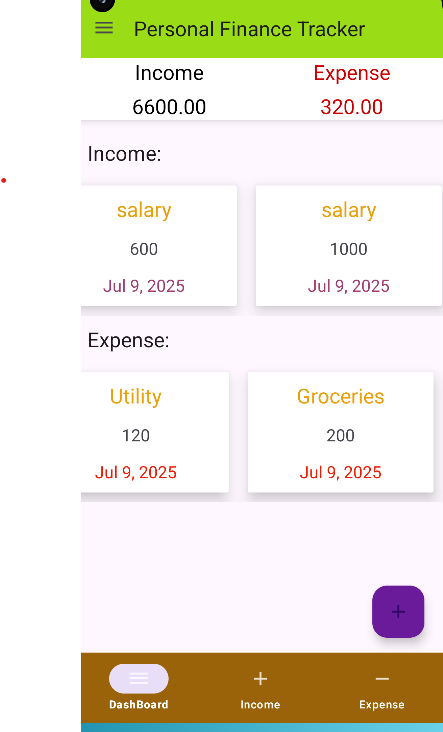
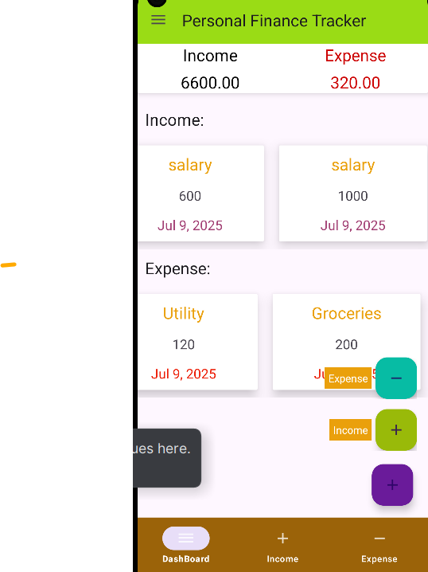
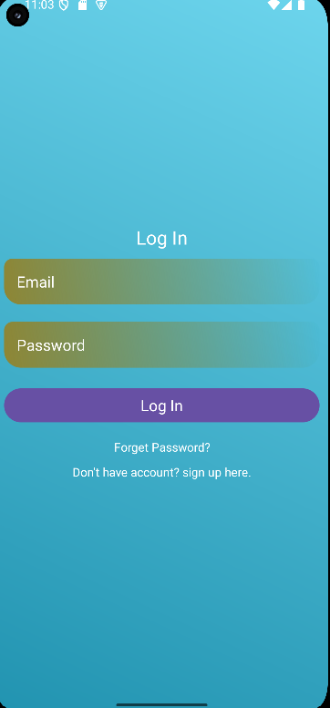
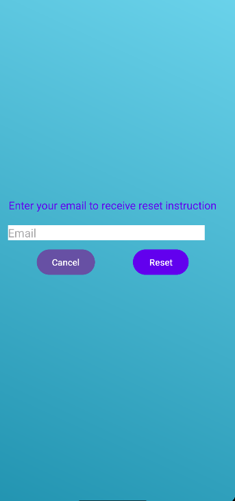

         Personal Finance Tracker
         
A simple Android app to track personal income and expenses.

      About the App
  
This app is created using Java and developed in Android Studio. It allows users to track their daily personal finances, including both income and expense records, in a simple and organized way.
The app is connected to Firebase Realtime Database, so the users data will be securely stored online and synced in real time.
  
     Features
    
   Dashboard View

The dashboard shows both income and expense data in one screen. Each section is placed one above the other and lets the user scroll through items horizontally.

  
  Add New Entry
  
Users can create new income or expense records by choosing a type, entering an amount, and adding a note.

   Edit and Delete
   
Existing records can be easily updated or removed with just a tap.

   Firebase Integration Details
   
The app uses Firebase Realtime Database to store and sync user data safely.

    Below are the main features:

User Login and Registration are done with Firebase Authentication using email and password.

The app saves, updates and deletes:

    Income records
    
    Expense records

Each user has their own data, saved under their unique user ID (UID), so it stays private.

Password reset is available. If a user forgets their password, they can receive a reset link by email.

All data changes are updated in real time.

Firebase Data Structure

  IncomeData
 └── BA0OIFV0neUu4eV7Nodk0F7C0Sn2
      └── -OUTQyIUwV2RTsxvA051
          ├── amount: 5000
          ├── date: "Jul 6, 2025"
          ├── id: "-OUTQyIUwV2RTsxvA051"
          ├── note: "monthly payment"
          └── type: "salary"

          

ExpenseDatabase
 └── BA0OIFV0neUu4eV7Nodk0F7C0Sn2
      └── -OUmjTKWx5I2-MSigh-5
          ├── amount: 200
          ├── date: "Jul 9, 2025"
          ├── id: "-OUmjTKWx5I2-MSigh-5"
          ├── note: "Food"
          └── type: "Groceries

  User Login and Registration  
  

Includes a login page and sign-up page to keep data private and secure.

  Password Reset  
  
User can reset their password if they forget it by reciving a reset email.

  Navigation Drawer
  
A sidebar menu gives quick access to Dashboard, Income, Expense, and Logout, each with its own icon.

 Bottom Navigation Bar
 
The app also has a bottom bar with icons for Dashboard, Income, and Expense screens.

    I used
    
  Language - Java
  
  IDE - Android Studio
  
  Backend - Firebase Realtime Database

  Authentication - Firebase Authentication(Email and Password)
